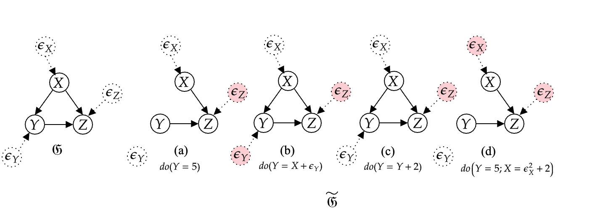

## On Noise Abduction for Answering Counterfactual Queries: A Practical Outlook



This is a PyTorch implementation of the our TMLR paper. This work builds on Pawlowski, Castro, and Glocker's [paper](https://arxiv.org/abs/2006.06485) and the code in this repository is adapted from  [](https://github.com/rongguangw/flow-scm "Go to GitHub repo"). Pawlowski, Castro, and Glocker's code repository can be found in [](https://github.com/biomedia-mira/deepscm "Go to GitHub repo").

This repository contains the code for the paper.
> S. Saha<sup>+</sup>, U. Garain. _On Noise Abduction for Answering Counterfactual Queries: A Practical Outlook_. Transactions on Machine Learning Research. 2022 
>

If you use pre-abduction idea in your publications, please consider citing the accompanying paper with a BibTeX entry similar to the following:

```
@article{
saha2022on,
title={On Noise Abduction for Answering Counterfactual Queries: A Practical Outlook },
author={Saptarshi Saha and Utpal Garain},
journal={Transactions on Machine Learning Research},
issn={2835-8856},
year={2022},
url={https://openreview.net/forum?id=4FU8Jz1Oyj},
note={}
}
```

(<sup>+</sup>: first author)


*P.S. - We will maintain this repository and will keep updating.* 


