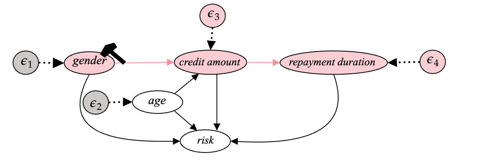

* 6 flows models: 3 types (affine, spline, autoregressive) $\times$ 2 order (linear, quadratic) 
* 2 different settings :
    * conditionalscm -       full model (doesn't follow pre-abduction)
    * conditionalscm_path -  partial model (follows pre-abduction) 
 * 2 interventions: do(sex=Male), do(sex=Female)  

---
## Structure

- `assets/`:
    - `plots/`: contains plots for the paper (generated using `plotter.py` and `visuals.ipynb`)
- `data/`:
    - `data.py`: creates german_credit_data.csv from german_credit_data_raw.csv
    - `german_credit_data.csv`: has been used in the experiment
    - `german_credit_data_raw.csv`: raw german credit data
- `datasets/`:
    - `counterfactuals/`: contains 24 csv file. These are generated counterfactuals.
- `loaders/`: 
    - `features.py`: creates a custom dataset from german_credit_data.csv 
- `logs/`: checkpoints for models
-  `models/`:
    - `nfs_path.py`: model that uses pre-abduction and doesn't infer all the noises
    - `nfs.py`: model that doesn't use pre-abduction and infers all the noises in abduction
    - `transforms.py`: few normalizing flows architecure
- `infer.py`: script for inference
- `inference.txt`: recorded associative power of the models used in inference and inference time (negligible time difference in our case)
- `plotter.py`: script for creating plots. It requires the directoy containing 24 counterfactual files (in csv format) like 'datasets/counterfactuals' . see `visuals.ipynb`.
-  `train_infer.ipynb`: we run the training and inference scripts for different models from this jupyter notebook. One can use the similar commands in terminal also.
- `train.py`: script for training a model.
- `trainig.txt`: recorded training configuration and training time.
- `utils.py`: few useful things (avoidable)

---
