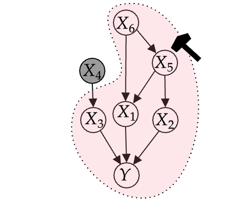

### *Structural Causal Model*

$X_{4}=2\epsilon_{4}+1$
<br>
$X_{6}=\epsilon_{6}-1$
<br>
$X_{5}=3X_{6}+\epsilon_{5}-1$
<br>
$X_{2}=X_{5}-\epsilon_{2}$
<br>
$X_{3}=-3X_{4}+\epsilon_{3}-3$
<br>
$X_{1}=X_{6}-X_{5}+3\epsilon_{1}$
<br>
$Y=X_{1}+2X_{2}-3X_{3}+\epsilon_{Y}$


---

## Experiments

There is three experiments - *i) different seeds experiment*, *ii)sample_size vs train time* and *iii)specific seed experiment*.

### specific seed experiment
- `specific_seed_experiment/`: 
- `specific_seed_experiment.ipynb` :


### sample_size vs train time
- `sample_size_vs_train_time/` :
- `train_time_experiment.ipynb` :
- `train_time_experiment.py`:


### different seeds experiment
- `different_seeds_experiment/`:
- `different_seeds_experiment.ipynb` :
- `different_seeds_experiment.py ` :


---

## Structure
- `analysis.py`: contains utility functions for creating plots for sampling capability, noise inference (abduction) capability, counterfactuals and estimating errors 
- `cf_analysis.py`: function for permorning counterfactual prediction
-  `config.py` : important hyperparams
- `data.py` : create dataset from the data generated by the SCM.
- `full_model.py` : full model
- `partial_model.py` : partial model
- `scm.py` : True SCM
- `train.py`: script for training full model or partial model
- `utils.py` :  mkdir function (will be removed)
```diff
-  `synthetic_data_experiment.ipynb` : kind of idea scratchpad ... (one can start from here for understanding)
```

---
